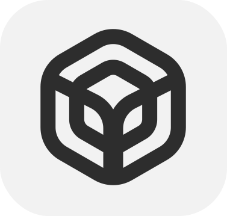

# Vitual Space

App Virtualization Engine which allows the user to bypass fundamental restrictions of the Android system without modifying the OS, enabling system-level control within an isolated environment that functions as a distinct virtual device.

  

**Tech Stack:**  
Languages: Java, Kotlin, C++ 
Low-level Android Internals: Binder IPC, AIDL, ShadowHook, QBDI, Xposed (Pine), Reflection, Hidden API 
Other: Coroutines, Flow, LiveData, Surface API, WireGuard, SingBox 

 
 

### Virtual Network
Independent Network Layer (Android VpnService API Bypass)
1. Traffic Isolation: Fully isolates and controls network traffic within the space. It allows the user to set up any WireGuard server and work through VPN without occupying the system VPN slot (Android VpnService API)
2. Per-Space Routing: Every virtual space can configure its own VPN server. For example, Telegram in Space-1 routes via Brazil, while Telegram in Space-2 routes via the UK simultaneously
3. Encrypted Traffic: Works with SingBox to encrypt and masquerade outgoing traffic. Explicitly designed to bypass state-level censorship (GFW or Great Firewall) and Deep Packet Inspection (DPI) systems, enabling seamless emulation of physical presence in restricted regions (e.g., accessing WeChat via a CN node while located in the US)

 

<h3>
  <a href="https://youtu.be/ScTg1wiuQCo">
    Video Demo
  </a>
</h3>

 

### Virtual Camera
Device Hardware (HAL) Emulation

Injects custom media resources directly into the camera stream, replacing physical sensor input. The system renders static images or video footage, feeding the data as a verified, live hardware capture.

 

<h3>
  <a href="https://youtu.be/04CarEktblo">
    Video Demo
  </a>
</h3>

 

### Virtual Isolation
Virtual Environment Abstraction
1. Virtual File System: Every space has its own virtual filesystem hierarchy. Global paths (e.g., /Downloads, /DCIM) are remapped to internal virtual directories. The data inside is protected and remains inaccessible to the host OS or PC, requiring root privileges for access.
2. Per-Space Unique Identifiers: Injects unique hardware fingerprints and device IDs for every space. This decouples the virtual environment from the host, preventing cross-app tracking and host identification.
3. Anti-Leave Protection: Intercepts outgoing system intents (external links, browsers, or galleries). If the target application is not installed within the space, the request is aborted to prevent environment escapes and data leaks.

 

<h3>
  <a href="https://www.youtube.com/watch?v=Ggslzk5mXnI">
    Video Demo
  </a>
</h3>

 

### Experimental & Compatibility
Clones system-level applications like GMS and Chrome, with stable support up to Android 12 and partial compatibility with Android 16.
The environment also includes features to hide Root and Xposed traces, ensuring system modifications remain invisible to other applications, tested up to Android 12.

 

### Summary & Vision
The project is moving toward a completely invisible virtualization layer, indistinguishable from a physical device at the core level. 
This creates a foundation for a fully isolated OS environment within Android, offering unimaginable potential for privacy and secure data management.

  

See my other projects!
<h5>
  <a href="https://github.com/Tretiakk/Cap-Taxi-Demo">
    Cap Taxi (Ride-Hailing App)
  </a>
</h5>
<h5>
  <a href="https://github.com/Tretiakk/Aqua-AI-Demo">
    Aqua AI (OpenAI Client)
  </a>
</h5>
<h5>
  <a href="https://github.com/Tretiakk/Anyalen-Demo">
    Anyalen (Agency MVP)
  </a>
</h5>
<h5>
  <a href="https://github.com/Tretiakk/Weather-Demo">
    Weather (Location-Aware Forecast)
  </a>
</h5>

